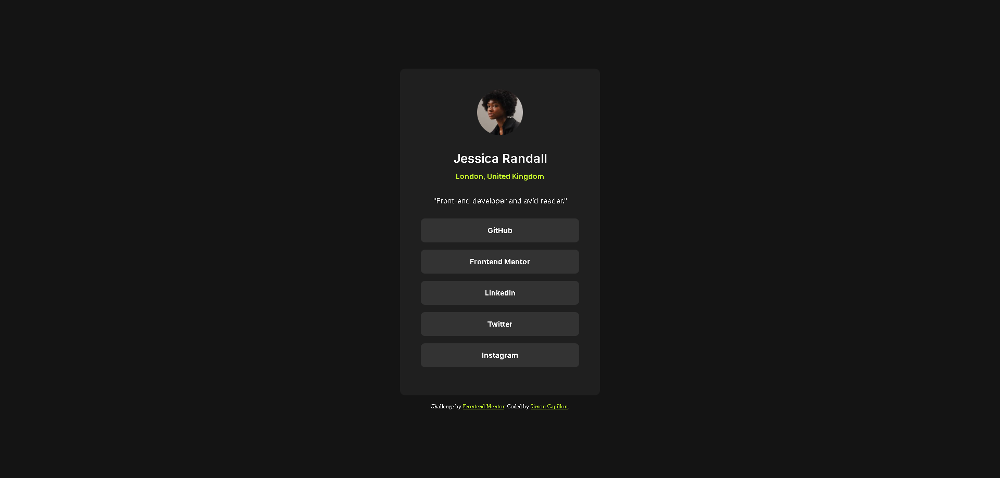

# Frontend Mentor - Social links profile solution

This is a solution to the [Social links profile challenge on Frontend Mentor](https://www.frontendmentor.io/challenges/social-links-profile-UG32l9m6dQ). Frontend Mentor challenges help you improve your coding skills by building realistic projects. 

## Table of contents

- [Overview](#overview)
  - [The challenge](#the-challenge)
  - [Screenshot](#screenshot)
  - [Links](#links)
- [My process](#my-process)
  - [Built with](#built-with)
  - [What I learned](#what-i-learned)
  - [Continued development](#continued-development)
  - [Useful resources](#useful-resources)
- [Author](#author)
- [Acknowledgments](#acknowledgments)

## Overview

### The challenge

Users should be able to:

- See hover and focus states for all interactive elements on the page

### Screenshot

### Links

- Live Site URL: [Live site URL](https://social-links-profile-frontend-mentort.vercel.app/)

## My process

### Built with

- Semantic HTML5 markup
- CSS custom properties
- Flexbox

### What I learned

I didn't had Figma files for this project, so I only worked with designs in .jpeg format. I used Photoshop to quickly calculate the dimensions in pixels (unfortunately it's much more approximate than with Figma). 😪

### Useful resources

- [CSS custom properties (variables)](https://developer.mozilla.org/en-US/docs/Web/CSS/Using_CSS_custom_properties) - I really love this CSS feature, it didn't exist when I learned css. Useful !
- [CSS Reset](https://meyerweb.com/eric/tools/css/reset/) - For a better CSS start.

## Author

- Website - [Simon Capillon](https://simoncapillon.com/)
- Frontend Mentor - [@simon7195](https://www.frontendmentor.io/profile/simon7195)
